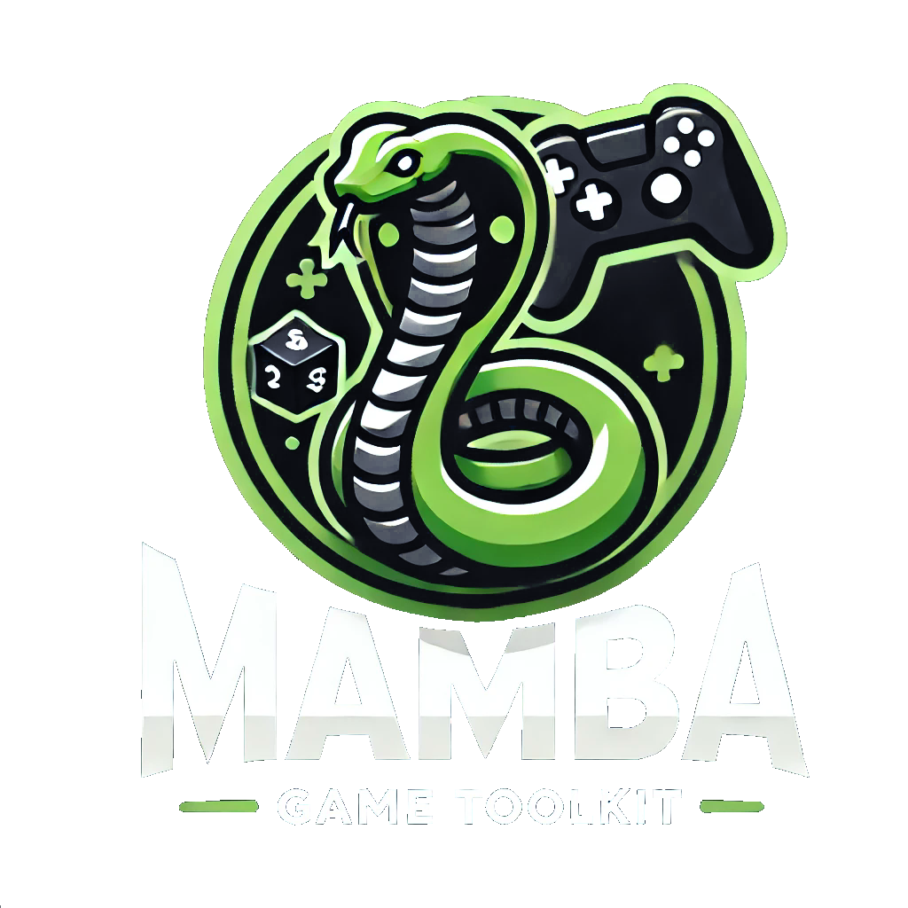

  

        
[](https://discord.gg/tPWjMwK) [](https://twitter.com/tinyBigGAMES) 

## Overview
Mamba Game Toolkit (MGT) is a sophisticated yet easy-to-use 2D game development library for [Delphi](https://www.embarcadero.com/products/delphi). Tailored to meet the needs of Windows developers, MGT offers a streamlined approach to building 2D games, focusing on simplicity, performance, and reducing external dependencies. With everything linked directly into the executable️, it eliminates the need for runtime DLLs, simplifying deployment and enhancing the overall stability and reliability of your projects.

This toolkit has been meticulously crafted and tested on Windows 11, utilizing cutting-edge technologies 🛠️ and the latest toolchains to ensure a seamless development experience. It supports Win64 and Unicode, making it highly versatile for projects on Windows 10 and above. By leveraging the latest OS features and enhancements, it delivers a smooth and optimized gaming experience, perfectly suited for modern game development.

The latest version can be downloaded from [the GitHub repository](https://github.com/tinyBigGAMES/mambagametoolkit/archive/refs/heads/main.zip). We recommend checking back often for updates 🔄 and new features as the toolkit evolves 🛠️.

## Features
Mamba Game Toolkit offers a comprehensive suite of features for 🕹️ game development, including:

- **📂 IO Support**: Mamba provides out-of-the-box support for Memory, File, and ZipFile IO operations. Additionally, the IO interface allows you to create custom IO handlers that can be passed to methods supporting the IO interface, providing flexibility for handling various data sources, whether they're from memory, files, or custom streams.

- **🔗 Direct Linking of Dependencies**: No runtime DLLs! All C dependencies 🛠️, such as `GLFW`, `cute_headers`, `stb`, `minizip`, and `pl_mpeg`, are compiled into a single object file (`Mamba.Deps.o`) and linked directly into your Delphi executable using `{$L Mamba.Deps.o}`. This approach eliminates the need for external DLLs, reduces deployment headaches 🤕, and minimizes interference from antivirus software 🛡️, making your game more secure and easier to distribute.

- **🖼️ Graphics and Video**:
  - 🎨 Texture management, color manipulation, and rendering of geometric shapes.
  - 📽️ Video playback support for MPEG-1 videos, seamlessly integrated with the toolkit, allowing you to add rich multimedia experiences to your games.

- **🎵 Audio**:
  - 🎶 Background music and sound effects, supporting multiple formats to enhance the immersive quality of your game.
  - 🔊 Control over volume, looping, and playback position for detailed sound design, giving you the tools needed to create an engaging audio experience.

- **🕹️ Input Handling**:
  - ⌨️ Keyboard, 🖱️ mouse, and 🎮 gamepad support to cater to a wide range of input devices. This ensures that your games are accessible and intuitive for users, no matter their preferred control method.

- **🖥️ Console Output**:
  - Extensive control over console output, including cursor positioning ➡️, color manipulation 🌈, and text formatting ✍️. This can be particularly useful for debugging 🐞 or creating in-game console features.

- **📐 Math Utilities**:
  - ➗ Vector math, easing functions, collision detection 💥, and various geometric utilities 📏. These functions make it easy to handle game physics ⚙️, animations 🎞️, and other calculations required for a smooth gameplay experience.

- **⚡ Optimized Workflow**:
  - Easy setup—just add `Mamba` to your `uses` section, and you're ready to develop! No complex setup steps or configuration needed, allowing you to jump straight into game development with minimal friction.

## Key Benefits
- **🔗 Integrated Dependencies**: Unlike many other game toolkits that require external DLLs, Mamba's dependencies are compiled directly into your executable️, ensuring simplicity and robustness. This eliminates the hassle of managing DLLs during deployment and makes your game more stable and secure.

- **🚀 Performance**: Using the latest clang-based toolchain in Delphi's RAD Studio 12.2, Mamba is built with performance in mind. The toolkit is optimized to ensure that your games run smoothly and efficiently, even on older hardware 🖥️, providing an excellent experience for players.

- **🪟 Windows Focused**: Mamba is optimized for Windows 10 and higher, allowing you to take full advantage of native Windows APIs and modern OS features. This makes Mamba an ideal choice for developers targeting the Windows platform, as it seamlessly integrates with the Windows environment to provide high performance and compatibility.

- **🎮 Full Game Development Suite**: Mamba provides everything from rendering and input to sound and video playback, making it a one-stop solution for your 2D️ game development needs. You don't need to integrate multiple libraries or deal with compatibility issues—Mamba has everything you need in one comprehensive package.

## Example Code
Here's a quick example to demonstrate the ease of use of the Mamba Game Toolkit:

```Delphi
var
  LWindow: IWindow;
  LTexture: ITexture;
  LFont: IFont;
  LPos: TPoint;
  LHudPos: TPoint;
begin
  IGet(IWindow, LWindow);

  LWindow.Open('MGT: Texture #01');

  IGet(IFont, LFont);
  LFont.Load(LWindow, 10);

  IGet(ITexture, LTexture);
  LTexture.LoadFromZipFile(CZipFilename, 'res/images/mgt.png');
  LTexture.SetPos(LWindow.GetVirtualSize().w/2, LWindow.GetVirtualSize().h/2);
  LTexture.SetScale(0.5);

  LPos.x := 0;
  LPos.y := 25;

  while not LWindow.ShouldClose() do
  begin
    LWindow.StartFrame();

      if LWindow.GetKey(KEY_ESCAPE, isWasPressed) then
        LWindow.SetShouldClose(True);

      if LWindow.GetKey(KEY_F11, isWasPressed) then
        LWindow.ToggleFullscreen();

      LPos.x := LPos.x + 3.0;
      if LPos.x > LWindow.GetVirtualSize().w + 25 then
        LPos.x := -25;

      LWindow.StartDrawing();

        LWindow.Clear(DARKSLATEBROWN);

        LTexture.Draw(LWindow);

        LWindow.DrawFilledRect(LPos.x, LPos.y, 50, 50, RED, 0);

        LHudPos := Math.Point(3, 3);

        LFont.DrawText(LWindow, LHudPos.x, LHudPos.y, 0, WHITE, haLeft, '%d fps', [LWindow.GetFrameRate()]);
        LFont.DrawText(LWindow, LHudPos.x, LHudPos.y, 0, WHITE, haLeft, 'ESC - Quit', []);
        LFont.DrawText(LWindow, LHudPos.x, LHudPos.y, 0, WHITE, haLeft, 'F11 - Toggle fullscreen', []);

      LWindow.EndDrawing();

    LWindow.EndFrame();
  end;

  IRelease(LTexture);

  IRelease(LFont);

  LWindow.Close();

  IRelease(LWindow);
end;
```

In this example, we create a window, load a texture, and continuously render it within the game loop until the window is closed. The simplicity of this code demonstrates how Mamba handles the complexities of development, allowing you to focus on the creative aspects.

## API Overview
### 🖥️ Console API
Mamba's console API gives you detailed control over the text-based console output:
- **➡️ Cursor Movement**: Move the cursor using various escape sequences (`CSICursorUp`, `CSICursorPos`, etc.).
- **🎨 Text Formatting**: Set text color, boldness, and other attributes, allowing for highly customizable console displays.
- **🧹 Screen Manipulation**: Clear the screen, scroll, and more, providing you with the tools needed for effective console management during gameplay or debugging.

### 📐 Math Utilities
The Math module provides functions for creating and manipulating vectors, points, rectangles, and other geometrical entities. Some key utilities include:
- **📈 Easing Functions**: Smooth animations with various easing functions (`TEaseType`). These functions make it easy to create natural-looking motion in your games, whether it's for character movement or UI transitions️.
- **💥 Collision Detection**: Easily detect overlaps between geometric shapes. This is crucial for gameplay elements such as detecting hits, obstacles, or player interactions.

### 🕹️ Input Handling
Mamba handles multiple input sources, from keyboard keys ⌨️ to gamepad buttons 🎮, allowing for versatile player interaction:
- **⌨️ Keyboard and Mouse**: Polling functions such as `GetKey()` and `GetMouseButton()` make it easy to track input, allowing for responsive and intuitive control schemes.
- **🎮 Gamepad Support**: Gamepad button states can be tracked to enhance game control, providing support for a variety of gaming setups and player preferences.

### 🎨 Rendering API
Mamba includes a rich rendering API:
- **🖼️ Textures and Drawing**: Easily load, manipulate, and draw textures to the screen, allowing for dynamic visuals and sprite management.
- **🔺 Graphics Primitives**: Render a variety of graphics primitives including lines (`DrawLine()`), rectangles (`DrawRect()`, `DrawFilledRect()`), circles (`DrawCircle()`, `DrawFilledCircle()`), triangles (`DrawTriangle()`, `DrawFilledTriangle()`), and polygons (`DrawPolygon()`, `DrawFilledPolygon()`, `DrawPolyline()`). These primitives make it easy to add visual elements to your game without the need for external assets.

### 🎵 Audio & 📽️ Video
- **🎶 Audio Management**: Load and play background music and sound effects with simple commands like `PlayMusic()` and `SetVolume()`. With support for multiple formats, you can provide a rich auditory experience that enhances the player's immersion.
- **📽️ Video Playback**: Play MPEG-1 videos integrated into your game, with looping and volume control, making it possible to include cutscenes or animated sequences directly within your game.

## Getting Started
1. **⬇️ Download and Install**: You can download the latest version [here](https://github.com/tinyBigGAMES/mambagametoolkit/archive/refs/heads/main.zip). Simply extract the files and add them to your project.
2. **📄 Include Mamba in Your Project**: Add `Mamba` to the `uses` section of your project. This allows you to access all the powerful features of the toolkit.
3. **⚡ Start Developing**: Utilize the powerful API to create your 2D game! With Mamba, the development process is streamlined, enabling you to focus on creativity and gameplay rather than technical hurdles.
4. 📂 Load the Example Project: Open the `Mamba Game Toolkit.groupproj` file located in the `src` folder to run the examples and learn how to use the toolkit. Start by running `ZipFile01` first to build the data.zip file required by the examples.

## Requirements
- **🛠️ Compiler**: You’ll need Delphi 12.2 or higher, and C++ Builder 12.2 or higher to compile the C sources, ensuring you have the essential tools to manage all of Mamba's integrated dependencies.
- **🪟 OS**: Windows 10 64-bit or higher.

## Future Development
Mamba Game Toolkit is under active development, and we are continuously adding new features and improving the library. Contributions are welcome! Feel free to fork the repository, submit pull requests, or suggest new features. We aim to keep Mamba at the forefront of 2D game development technology, providing a solid foundation for both hobbyists and professional developers alike.

### Contributing

Contributions to **MGT** are welcome! If you’d like to contribute to this project, feel free to submit issues or pull requests on our [GitHub repository](https://github.com/tinyBigGAMES/mambagametoolkit).

<a href="https://github.com/tinyBigGAMES/mambagametoolkit/graphs/contributors">
  
</a>


## License
This project is licensed under the BSD-3-Clause License - see the [LICENSE](https://github.com/tinyBigGAMES/mambagametoolkit#BSD-3-Clause-1-ov-file) file for details. This license allows you to freely use, modify, and distribute the toolkit, making it a great choice for open-source projects and commercial endeavors alike.

## Support

- <a href="https://github.com/tinyBigGAMES/mambagametoolkit/issues" target="_blank">Issues</a>
- <a href="https://github.com/tinyBigGAMES/mambagametoolkit/discussions" target="_blank">Discussions</a>
- <a href="https://github.com/tinyBigGAMES/mambagametoolkit/wiki" target="_blank">Wiki</a>
- <a href="https://www.facebook.com/groups/mambagametoolkit" target="_blank">FaceBook Group</a>
- <a href="https://learndelphi.org/" target="_blank">Learn Delphi</a>

<p align="center">

</p>
<h5 align="center">

Made with :heart: in Delphi
</h5>
